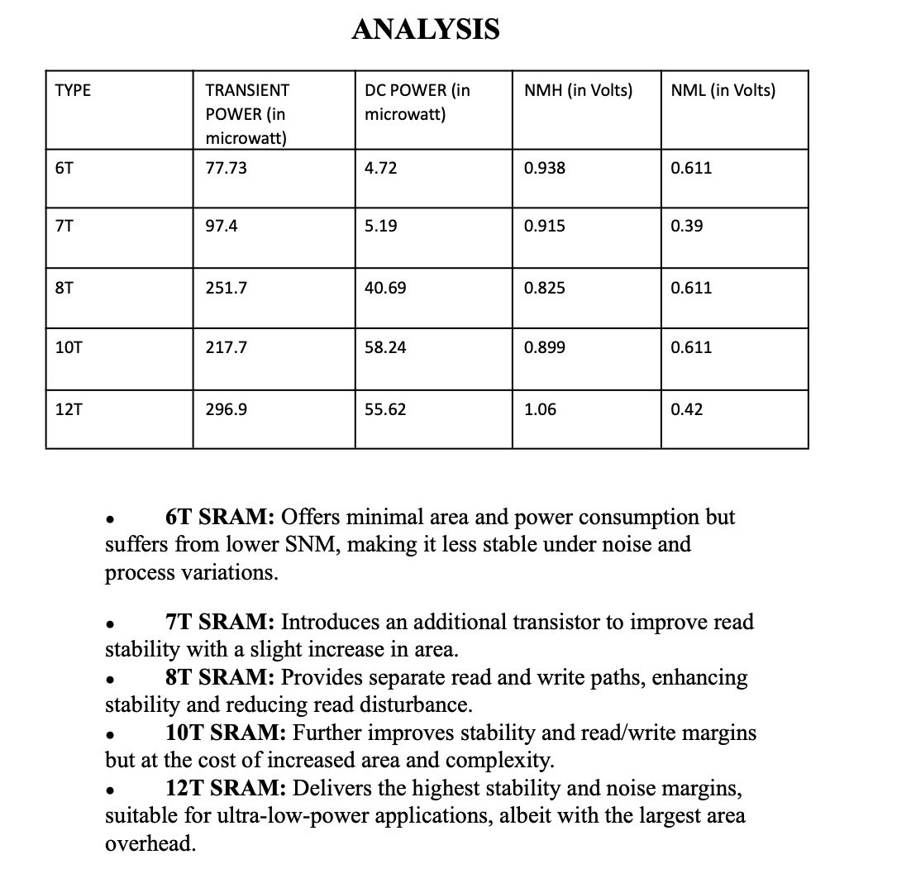
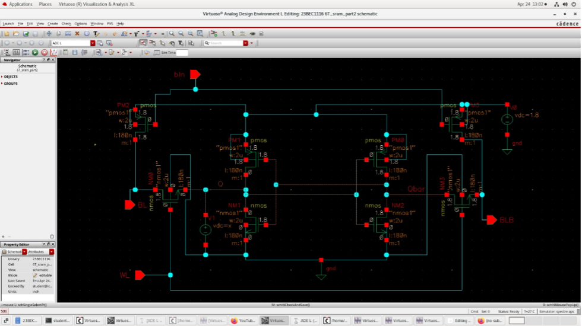
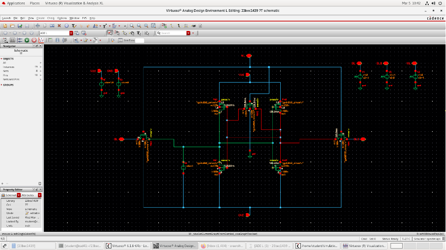
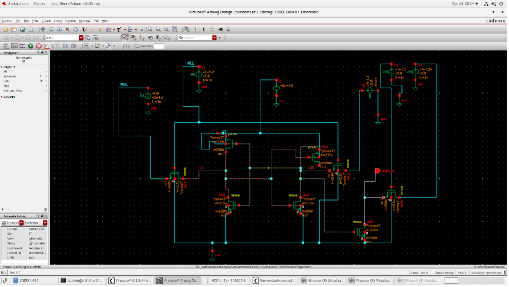
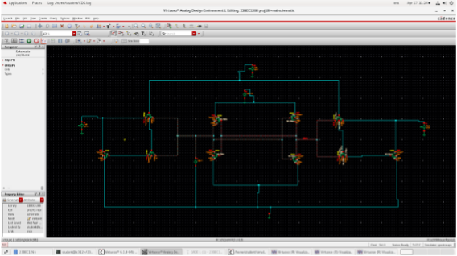
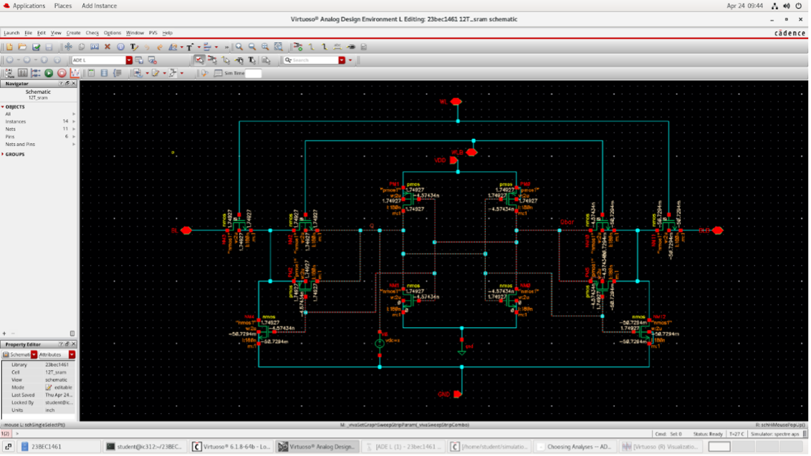
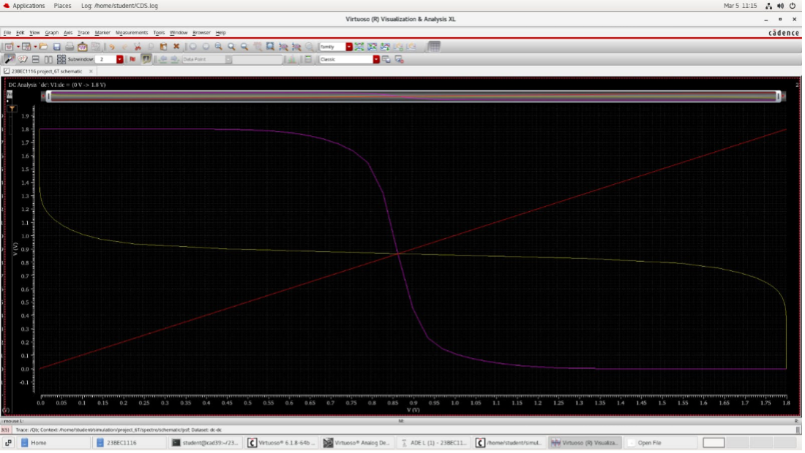
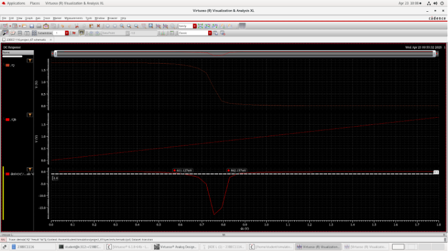
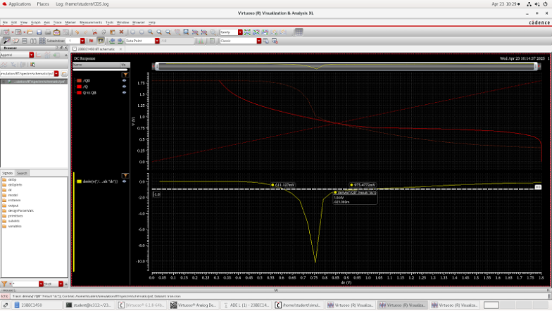
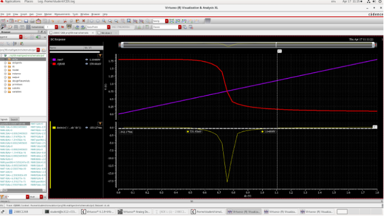

# Comparative Analysis of SRAM Cells — 6T to 12T

Design and simulation of five SRAM topologies (6T, 7T, 8T, 10T, 12T) in Cadence Virtuoso, evaluated on Static Noise Margin, DC power, and transient power consumption.

---

## Overview

This project compares standard and extended SRAM cell architectures at the transistor level. Each topology was designed from scratch in Cadence Virtuoso and simulated using DC and transient analyses. The goal was to quantify the trade-offs between stability, power, and transistor count across all five designs.

All simulations were run at VDD = 1.8V using a standard CMOS process.

---

## Topologies Covered

| Topology | Transistor Count | Read Path | Write Path |
|---|---|---|---|
| 6T | 6 | Shared (BL/BLB) | Shared (BL/BLB) |
| 7T | 7 | Separate (RBL) | BL |
| 8T | 8 | Isolated read buffer | BL |
| 10T | 10 | Differential read buffer | WBL/WBLB |
| 12T | 12 | Fully decoupled | WBL/WBLB |

---

## Results



| Topology | Transient Power (uW) | DC Power (uW) | NMH (V) | NML (V) |
|---|---|---|---|---|
| 6T  | 77.73  | 4.72  | 0.938 | 0.611 |
| 7T  | 97.40  | 5.19  | 0.915 | 0.390 |
| 8T  | 251.70 | 40.69 | 0.825 | 0.611 |
| 10T | 217.70 | 58.24 | 0.899 | 0.611 |
| 12T | 296.90 | 55.62 | 1.060 | 0.420 |

**Key observations:**
- 6T has the lowest power consumption but the weakest read stability due to the shared read/write path
- 8T and 10T offer a balanced improvement — separate read paths reduce read disturbance significantly
- 12T achieves the highest NMH (1.06V) with fully decoupled read and write, at the cost of highest area and power
- 7T offers a minimal overhead improvement over 6T with marginal gain in read SNM

---

## Schematics

| 6T | 7T |
|---|---|
|  |  |

| 8T | 10T |
|---|---|
|  |  |

| 12T |
|---|
|  |

---

## Simulation Plots

### Butterfly Curves (SNM Analysis)

SNM was extracted using the butterfly curve method — overlaying the VTC of both cross-coupled inverters, one mirrored horizontally. The largest inscribed square determines the SNM value.

| 6T Butterfly | 7T Butterfly |
|---|---|
|  |  |

### DC Transfer Characteristics

| 6T DC | 8T DC | 10T DC |
|---|---|---|
|  |  |  |

### Transient Power

Dynamic power was measured during read/write switching operations.

| 6T | 8T | 10T |
|---|---|---|
|  |  |  |

---

## Simulation Setup

- Tool: Cadence Virtuoso (Analog Design Environment)
- Supply voltage: VDD = 1.8V
- DC analysis: butterfly curve method for SNM extraction
- Transient analysis: dynamic power during read/write cycles
- Process: standard CMOS (180nm node)

---

## Design Observations

**6T:** Minimal area, lowest power. Read and write share the same bit lines, which degrades read SNM due to voltage contention at the storage node during access.

**7T:** An additional NMOS between the inverter loop and GND partially isolates the storage node during reads. Marginal SNM improvement over 6T.

**8T:** Dedicated read port using a two-transistor read buffer (M6, M7) completely decouples the read path from storage nodes. Eliminates read disturbance. Power increases significantly.

**10T:** Fully differential read buffer (M7-M10) with a separate read word line. Improved read SNM and better noise rejection. Higher transistor overhead.

**12T:** Read and write paths are fully independent. Write uses NMOS pass gates (M5, M6 via WWL), read uses a sense-amplifier-style buffer (M7-M12). Highest stability, highest area.

---

## Repository Structure

```
Comparative-Analysis-of-SRAM-Cells-6T-12T/
├── schematics/        Cadence schematic screenshots for each topology
├── simulations/       DC curves, butterfly curves, transient plots
├── docs/              Design report and results PDF
├── results/           Summary comparison table
└── README.md
```

---

## Tools

- Cadence Virtuoso — schematic entry and simulation
- Virtuoso Analog Design Environment (ADE) — DC and transient analysis
- Virtuoso Visualization & Analysis XL — waveform viewing and power measurement

---

## Reference

Designed and simulated as part of the VLSI Design course, B.E. Electronics and Communication Engineering.

---

## License

MIT License — see [LICENSE](LICENSE) for details.
